# UE打包上传&&克隆github

文件过大问题

一般删除 .vs    Intermediate两个文件即可

以下是UE项目中一些可以删除的文件及文件夹：

- .vs文件夹及相关文件：包含虚幻IDE相关配置和临时文件、历史记录等，由VS生成。若要更换编译器则必须删除，删除后可重新生成.
- Binaries文件夹：存放编译生成的二进制文件，针对不同平台和配置进行发布、运行等。若不需要使用已编译好的二进制文件，可将其删除，再次编译项目时会重新生成.
- DerivedDataCache文件夹：包含着色器预制编译等派生数据文件。若不打算重新编译或构建项目，可删除此文件夹以释放空间，不过下次打开项目时会重新生成相关数据，导致项目打开速度变慢.
- Intermediate文件夹：包含中间文件、临时文件、缓存文件等，如UnrealBuildTool生成的文件、Visual Studio项目文件等，可删除，但再次打开项目或重新编译时会重新生成.
- Saved文件夹：包含引擎生成的文件，如配置文件和日志等，可删除，不过若项目出现问题，这些文件中的日志信息可能有助于排查，确定项目无问题时可删除.
- .vsconfig文件：由VS生成，包含VS的SDK版本等信息，可删除，需要时可重新生成.
- .sln文件：使用此文件可通过VS打开C++代码，可由.uproject文件生成，若不需要通过此文件打开项目，可删除.

## 从github克隆UE项目

1.克隆下UE项目

2.重构项目
从文件夹中双击打开自动重构
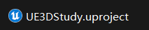

3.进入项目后
工具-->重新生成C++代码-->打开C++代码-->关闭虚幻编辑器-->在C++代码中重新生成项目

# UE指针（TObject）

```
         AMyPlayer*  PlayerCharacter

         TObjectPtr<AMyPlayer> PlayerCharacter;
        //建议使用
```

# UPROPERTY标签

    UPROPERTY(BlueprintReadOnly)
     //蓝图只读
    
    UPROPERTY(EditAnywhere, BlueprintReadWrite)
    //所以地方可编辑，蓝图可读写
    
    UPROPERTY(VisibleAnywhere, BlueprintReadWrite)
    //所有地方可见，蓝图可读写
    
    UFUNCTION(BlueprintCallable)
    //对函数进行修饰，让其可以被蓝图调用

# 配置输入映射

```
    1     void AMainPlayer::BeginPlay()
    2     {
    3         Super::BeginPlay();
    4 
    5         //添加输入映射内容
    6         if (APlayerController* PlayerController = Cast<APlayerController>(Controller))
    7         {
    8             //获取本地玩家子系统
    9             if (UEnhancedInputLocalPlayerSubsystem* Subsystem =
   10                 ULocalPlayer::GetSubsystem<UEnhancedInputLocalPlayerSubsystem>(PlayerController->GetLocalPlayer()))
   11             {
   12                 //添加映射上下文
   13                 Subsystem->AddMappingContext(InputMapping, 0);
   14             }
   15         }
```

# 动画

## UE蒙太奇在C++中使用

在 头文件中 声明

```//创建动画蒙太奇函数
    void AnimMontagePlay(UAnimMontage* MontageToPlay, FName SectionName = "Default", float PlayRate = 1.0f);

    UPROPERTY(EditAnywhere, BlueprintReadWrite, Category="Montage", meta=(AllowPrivateAccess="true"))
    UAnimMontage* AttackMontage;
```

在.cpp中实现

```void
       {
               UAnimInstance* AnimInstance = Cast<UAnimInstance>(GetMesh()->GetAnimInstance());
                if (AnimInstance && MontageToPlay)
               {
                        //检查动画蒙太奇是否在播放
                       if (!AnimInstance->Montage_IsPlaying(MontageToPlay))
                        {
                                PlayAnimMontage(MontageToPlay, PlayRate, SectionName);
                       }
               }
       }
```

调用

```
        Input->BindAction(RollAction, ETriggerEvent::Triggered, this, &AMainPlayer::Roll);

        void AMainPlayer::Roll(){
                AnimMontagePlay(AttackMontage, FName("Attack5"));

        }
```

## 动画通知

### 动画状态通知

**有开始和结束**
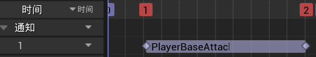

### 动画通知

**只有开始没有结束**

## 动画蓝图的使用（结合混合空间）

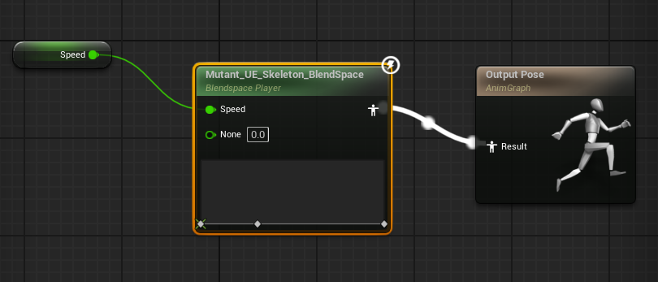
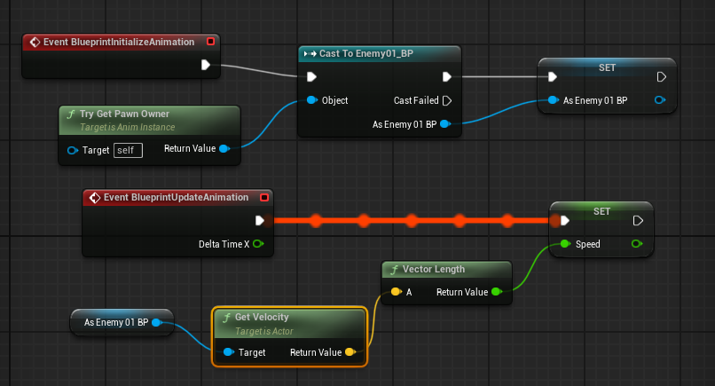

# 玩家类中的设置(APlayerCharacter)

## （重要）获取玩家控制器

```cpp
APlayerController* PlayerController = Cast<APlayerController>(GetController());
if (PlayerController)
{
    // 启用鼠标光标和点击事件
    PlayerController->bShowMouseCursor = true;
    PlayerController->bEnableClickEvents = true;
    PlayerController->bEnableMouseOverEvents = true;
}
```

## 玩家速度设置

```cpp
#include "GameFramework/CharacterMovementComponent.h"
```

```cpp
GetCharacterMovement()->MaxWalkSpeed = PlayerMoveSpeed;
```

## 按键映射建立

1.增强输入头文件

```cpp
         #include "EnhancedInputSubsystems.h"
         #include "EnhancedInputComponent.h"
```

2.声明映射

```cpp
         UPROPERTY(EditAnywhere, BlueprintReadWrite)
         TObjectPtr<UInputMappingContext> DefaultMapping;
```

3.声明输入组件

```cpp
         UPROPERTY(EditAnywhere, BlueprintReadWrite)
         TObjectPtr<UInputAction> MoveAction;

         UPROPERTY(EditAnywhere, BlueprintReadWrite)
         TObjectPtr<UInputAction> LookAction;

         UPROPERTY(EditAnywhere, BlueprintReadWrite)
         TObjectPtr<UInputAction> JumpAction;
```

4.配置映射（开始时配置）

```cpp
         void AMyPlayer::BeginPlay()
         {
                 Super::BeginPlay();
                 if (const ULocalPlayer* Player = GEngine && GetWorld() ? GEngine->GetFirstGamePlayer(GetWorld()):nullptr)
                 {
                         UEnhancedInputLocalPlayerSubsystem* Subsystem = ULocalPlayer::GetSubsystem<UEnhancedInputLocalPlayerSubsystem>(Player);
                         if (DefaultMapping) {
                             Subsystem->AddMappingContext(DefaultMapping, 0);
                         }
                }
        }
```

5.绑定函数

```cpp
         void AMyPlayer::SetupPlayerInputComponent(UInputComponent* PlayerInputComponent)
         {
                 Super::SetupPlayerInputComponent(PlayerInputComponent);
                 if (UEnhancedInputComponent* EnhancedInputComponent = CastChecked< UEnhancedInputComponent>(PlayerInputComponent)) {
                         EnhancedInputComponent->BindAction(LookAction, ETriggerEvent::Triggered, this, &AMyPlayer::Look);
                         EnhancedInputComponent->BindAction(MoveAction, ETriggerEvent::Triggered, this, &AMyPlayer::Move);
                         EnhancedInputComponent->BindAction(JumpAction, ETriggerEvent::Triggered, this, &AMyPlayer::Jump);
                         EnhancedInputComponent->BindAction(SpringArmAction, ETriggerEvent::Triggered, this, &AMyPlayer::SetSpringArm);
                 }
        }
```

## 设置玩家的一些基本组件

1.声明弹簧臂组件和相机组件

```cpp
         #include "Camera/CameraComponent.h"    // 包含 UCameraComponent
         #include "GameFramework/SpringArmComponent.h"  // 包含 USpringArmComponent

         UPROPERTY(VisibleAnywhere, BlueprintReadWrite)
         USpringArmComponent* SpringArm;

         UPROPERTY(VisibleAnywhere, BlueprintReadWrite)
         UCameraComponent* Camera;
```

2.在构造函数里设置

```cpp
         SpringArm = CreateDefaultSubobject<USpringArmComponent>(TEXT("SpringArm"));
         SpringArm->SetupAttachment(RootComponent);
         Camera = CreateDefaultSubobject<UCameraComponent>(TEXT("Camera"));
         Camera->SetupAttachment(SpringArm, USpringArmComponent::SocketName);

         //不要让玩家随着控制器旋转
         bUseControllerRotationPitch = false;
         bUseControllerRotationRoll = false;
         bUseControllerRotationYaw = false;
         //相机杆旋转 相机不旋转
         SpringArm->bUsePawnControlRotation = true;
         Camera->bUsePawnControlRotation = false;

         //角色根据运动方向旋转
        GetCharacterMovement()->bOrientRotationToMovement = true;
        GetCharacterMovement()->RotationRate = FRotator(0.f, 400.f, 0.f);
```

## 角色运动逻辑（函数）

1.声明运动函数（参数固定格式）

```cpp
         void Move(const FInputActionValue& Value);
```

2.逻辑实现

```cpp
         void AMyPlayer::Move(const FInputActionValue& Value)
         {
                 FVector2D MoveVector = Value.Get<FVector2D>();
                 if (Controller) {
                         const FRotator Rotation = Controller->GetControlRotation();
                         const FRotator YawRotator(0, Rotation.Yaw, 0);
                         const FVector ForwardDirection = FRotationMatrix(YawRotator).GetUnitAxis(EAxis::X);
                         const FVector RightDirection = FRotationMatrix(YawRotator).GetUnitAxis(EAxis::Y);
                         AddMovementInput(ForwardDirection, MoveVector.X);
                        AddMovementInput(RightDirection, MoveVector.Y);
                }

        }
```

## 角色跳跃

1.在.h中声明

```cpp
         //重写父类的Jump虚函数
         virtual void Jump() override;
```

2.在.cpp中定义

```cpp
        //跳函数
        void AMyCharacter::Jump()
        {
                Super::Jump();
        }
```

```cpp
         #include "GameFramework/CharacterMovementComponent.h" // 必须包含
```

```cpp
         // 在角色构造函数中设置
         AMyCharacter::AMyCharacter()
         {
             // 确保 CharacterMovement 存在
             if (GetCharacterMovement())
             {
                 GetCharacterMovement()->JumpZVelocity = 600.f; // 设置跳跃初速度
                 GetCharacterMovement()->GravityScale = 1.5f;   // 调整重力
             }
        }
```

## 角色滑翔

```cpp
// 在角色类中设置滑翔参数
void AMyCharacter::SetupGliding()
{
    GetCharacterMovement()->GravityScale = 0.2f; // 减小重力影响
    GetCharacterMovement()->AirControl = 0.8f;  // 增加空中控制
    GetCharacterMovement()->BrakingDecelerationFlying = 100.f; // 滑翔减速
}
```

## 地面检测

C++ 版本:

```cpp
if (GetCharacterMovement()->IsMovingOnGround())
{
    // 玩家在地面上
}
```

Blueprint版本:
` 获取你的角色移动组件 -> IsMovingOnGround 节点`

## 角色转向逻辑（函数）

1.声明转向函数（参数固定格式）

```cpp
         void Look(const FInputActionValue& Value);
```

构造函数中实现：

```
         //角色根据运动方向旋转
         GetCharacterMovement()->bOrientRotationToMovement = true;
         GetCharacterMovement()->RotationRate = FRotator(0.f, 400.f, 0.f);
```

2.逻辑实现

```cpp
         void AMyPlayer::Look(const FInputActionValue& Value)
         {
                 FVector2D LookVector = Value.Get<FVector2D>();
                 if (Controller) {
                         AddControllerYawInput(LookVector.X);
                         AddControllerPitchInput(LookVector.Y);
                          // 可选：限制抬头低头角度
                          FRotator CurrentRotation = GetControlRotation();
                         CurrentRotation.Pitch = FMath::Clamp(CurrentRotation.Pitch, -80.0f, 80.0f);
                          Controller->SetControlRotation(CurrentRotation);
                 }
         }
```

添加进玩家移动函数中

```
         //玩家转向设置

         if (InputVector.Y|| InputVector.X) {
                 SetActorRotation(YawRotation);
         }
```

缓慢旋转

```
         void AYourCharacter::Tick(float DeltaTime)
         {
             Super::Tick(DeltaTime);

         // 目标旋转（假设为Yaw转向90度，Pitch和Roll不变）
             FRotator TargetRotation = FRotator(0.f, 90.f, 0.f); 

             // 当前旋转
             FRotator CurrentRotation = GetActorRotation();

            // 使用RInterpTo平滑插值（参数：当前值、目标值、插值速度、DeltaTime）
            FRotator NewRotation = FMath::RInterpTo(CurrentRotation, TargetRotation, DeltaTime, 2.0f); 

            // 应用旋转
            SetActorRotation(NewRotation);
        }
```

## 弹簧臂伸缩（函数）

1.声明转向函数（参数固定格式）

```
         UPROPERTY(VisibleAnywhere, BlueprintReadWrite)
         USpringArmComponent* SpringArm;

         UPROPERTY(VisibleAnywhere, BlueprintReadWrite)
         float SpringArmLenghtMax = 500;

         UPROPERTY(VisibleAnywhere, BlueprintReadWrite)
         float SpringArmLenghtMin = 50;

         void SetSpringArm(const FInputActionValue& Value);
```

2.逻辑实现

```
         void AMyPlayer::SetSpringArm(const FInputActionValue& Value)
         {                      
                 if (SpringArm->TargetArmLength - Value.Get<FVector>().X < SpringArmLenghtMax
                         && SpringArm->TargetArmLength - Value.Get<FVector>().X > SpringArmLenghtMin)
                 {
                 SpringArm->TargetArmLength -= Value.Get<FVector>().X * SpringArmSpeed;
                 }
                 if (SpringArm->TargetArmLength - Value.Get<FVector>().X > SpringArmLenghtMax)
                 {
                        SpringArm->TargetArmLength = SpringArmLenghtMax - 1;
                }
                if (SpringArm->TargetArmLength - Value.Get<FVector>().X < SpringArmLenghtMin)
                {
                        SpringArm->TargetArmLength = SpringArmLenghtMin + 1;
                }
        }
```

### 弹簧臂设置完整实例

```
            //弹簧臂伸缩最大值
            UPROPERTY(VisibleAnywhere, BlueprintReadWrite)
            float SpringArmLenghtMax = 500;
            //弹簧臂伸缩最小值
            UPROPERTY(VisibleAnywhere, BlueprintReadWrite)
            float SpringArmLenghtMin = 50;
            //弹簧臂伸缩速度
            UPROPERTY(VisibleAnywhere, BlueprintReadWrite)
            float SpringArmSpeed = 50;
           //弹簧臂伸缩控制函数
           void SetSpringArm(const FInputActionValue& Value);
```

```
             //创建弹簧臂伸缩动作
             UPROPERTY(EditAnywhere, Category = "EnhancedInput")
             UInputAction* SpringArmAction;
```

```cpp
             //不要让玩家随着控制器旋转
             bUseControllerRotationPitch = false;
             bUseControllerRotationRoll = false;
             bUseControllerRotationYaw = false;
             //相机杆旋转 相机不旋转
             SpringArmComponent->bUsePawnControlRotation = true;
             FollowCameraComponent->bUsePawnControlRotation = false;

             //角色根据运动方向旋转
            GetCharacterMovement()->bOrientRotationToMovement = true;
            GetCharacterMovement()->RotationRate = FRotator(0.f, 400.f, 0.f);

             void AMainPlayer::SetSpringArm(const FInputActionValue& Value)
             {
                     if (SpringArmComponent->TargetArmLength - Value.Get<FVector>().X < SpringArmLenghtMax
                             && SpringArmComponent->TargetArmLength - Value.Get<FVector>().X > SpringArmLenghtMin)
                     {
                             SpringArmComponent->TargetArmLength -= Value.Get<FVector>().X * SpringArmSpeed;
                     }
                     if (SpringArmComponent->TargetArmLength - Value.Get<FVector>().X > SpringArmLenghtMax)
                     {
                            SpringArmComponent->TargetArmLength = SpringArmLenghtMax - 1;
                    }
                    if (SpringArmComponent->TargetArmLength - Value.Get<FVector>().X < SpringArmLenghtMin)
                    {
                            SpringArmComponent->TargetArmLength = SpringArmLenghtMin + 1;
                    }
            }
```

```cpp
             Input->BindAction(SpringArmAction, ETriggerEvent::Completed, this, &AMainPlayer::SetSpringArm);
```

# Debug信息产生

在屏幕上打印字符

```cpp
GEngine->AddOnScreenDebugMessage(-1, 1, FColor::Blue, FString::Printf(TEXT("Jump test")));
```

在日志中输出

```
UE_LOG(LogTemp, Warning, TEXT("my message"));
```

两个坐标之间画一条线

```
DrawDebugLine(GetWorld(), Start, End, FColor::Blue);
```

输出物体坐标信息

```cpp
// 格式化坐标信息
FString LocationString = FString::Printf(TEXT("Location: X=%.2f, Y=%.2f, Z=%.2f"), ActorLocation.X, ActorLocation.Y, ActorLocation.Z);

// 在屏幕上显示坐标信息
GEngine->AddOnScreenDebugMessage(-1, 5.0f, FColor::Green, LocationString);
```

# Bug合集

## 头文件位置bug

```
      #include "MyPlayer.generated.h"
    //必须放在最后面
```

# Enemy的自动生成

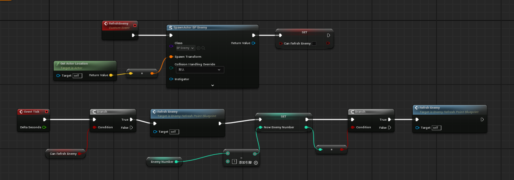

```
UPROPERTY(EditAnywhere, BlueprintReadWrite)
bool CanRefrshEnemy;

UPROPERTY(EditAnywhere, BlueprintReadWrite)
float GameStartTime;

UPROPERTY(EditAnywhere, BlueprintReadWrite)
int32 EnemyNumber;
int32 ThisStage;
```

```
AEnemyRefreshPoint::AEnemyRefreshPoint()
{
    PrimaryActorTick.bCanEverTick = true;
    SpwnLocation = GetActorLocation();
    GameStartTime = 0;
    EnemyNumber = 0;
    CanRefrshEnemy = true;
}
```

```
void AEnemyRefreshPoint::Tick(float DeltaTime)
{
        Super::Tick(DeltaTime);
        GameStartTime += 0.1;
        if(GameStartTime-0.1!=GameStartTime){
                ThisStage = GameStartTime;
        }
        switch (ThisStage) {
        case 100: EnemyNumber += 1; CanRefrshEnemy = true; break;
        case 200: EnemyNumber += 1; CanRefrshEnemy = true; break;
        case 300: EnemyNumber += 1; CanRefrshEnemy = true; break;
        case 400: EnemyNumber += 1; CanRefrshEnemy = true; break;
        }
}
```


# Enemy类中的相关设置

**声明变量&&函数**

```
bool CanSeePlayer = false;

TObjectPtr<ACharacter> TargetCharacter;

bool LineTraceActor(AActor* TargetActor);

bool CanSeeActor(const AActor* TargetActor, FVector Start, FVector End) const;
```

## Enemy自动面向玩家（函数）

```
bool AEnemy::LineTraceActor(AActor* TargetActor)
{
        if (TargetActor == nullptr)
        {
                return false;
        }
        FVector Start = GetActorLocation();
        FVector End = TargetActor->GetActorLocation();
        if (CanSeeActor(TargetActor, Start, End)) {
                FRotator DirectRotation = UKismetMathLibrary::FindLookAtRotation(Start, End);
                SetActorRotation(DirectRotation);
                return true;
        }
        return false;
}
```

## Enemy能否看见玩家（函数）

```cpp
    TargetCharacter = UGameplayStatics::GetPlayerCharacter(this, 0)
```

```cpp
bool AEnemy::CanSeeActor(const AActor* TargetActor, FVector Start, FVector End) const
{
        if (TargetActor == nullptr)
        {
                return false;
        }
        FHitResult Hit;
        ECollisionChannel Channel = ECollisionChannel::ECC_Visibility;
        //忽略玩家和敌人（this）
        FCollisionQueryParams QueryParams;
        QueryParams.AddIgnoredActor(this);
        QueryParams.AddIgnoredActor(TargetActor);

                //射线检测
        GetWorld()->LineTraceSingleByChannel(Hit, Start, End,Channel,QueryParams);

        //画线
        DrawDebugLine(GetWorld(), Start, End, FColor::Blue);
        return !Hit.bBlockingHit;
}
```

# Component（组件）

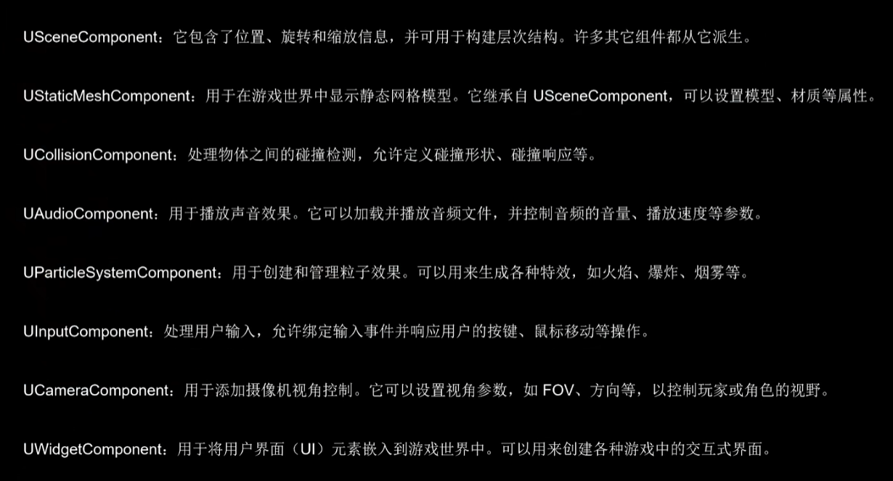

# UBoxComponent碰撞箱

```
         //声明碰撞箱组件
         UPROPERTY(EditAnywhere, BlueprintReadWrite)
         class UBoxComponent* CollisionComponent;

          // 创建碰撞组件
          CollisionComponent = CreateDefaultSubobject<UBoxComponent>(TEXT("CollisionComponent"));
          //将骨骼网格体设为父级，设置插槽位置为”Attack“
          CollisionComponent->SetupAttachment(GetMesh(), TEXT("Attack"));
```

**碰撞组件的应用**

碰撞开始和碰撞结束函数的声明

```
         UFUNCTION()
         void OnOverlapBegin(UPrimitiveComponent* OverlappedComp, AActor* OtherActor, UPrimitiveComponent* OtherComp, int32 OtherBodyIndex, bool bFromSweep, const FHitResult& SweepResult);

         UFUNCTION()
         void OnOverlapEnd(UPrimitiveComponent* OverlappedComp, AActor* OtherActor, UPrimitiveComponent* OtherComp, int32 OtherBodyIndex);
```

```
         // 绑定碰撞事件，在BeginPlay中
         CollisionComponent->OnComponentBeginOverlap.AddDynamic(this, &AEnemyBase::OnOverlapBegin);
         CollisionComponent->OnComponentEndOverlap.AddDynamic(this, &AEnemyBase::OnOverlapEnd);
```

# 子弹（AActor类）

头文件中声明

```
             UPROPERTY(VisibleAnywhere, BlueprintReadWrite)
             TObjectPtr<USphereComponent> SphereComponent;

             UPROPERTY(VisibleAnywhere, BlueprintReadWrite)
             TObjectPtr<UProjectileMovementComponent> ProjecttileMovement;

             FORCEINLINE UProjectileMovementComponent* GetProjecttileMovementComponent() const { return ProjecttileMovement; }
```

所需头文件

```
             #include "Components/SphereComponent.h"
             #include "GameFramework/ProjectileMovementComponent.h"
```

构造函数中

```
             SphereComponent = CreateDefaultSubobject<USphereComponent>("Sphere Collision");
             SphereComponent->SetSphereRadius(35.f);
             SetRootComponent(SphereComponent);

             ProjecttileMovement = CreateDefaultSubobject<UProjectileMovementComponent>("Projecttile Movement");
             ProjecttileMovement->InitialSpeed = 1300.f;
```

# Actor生成


## SpawnActor

```cpp
TSubclassOf<ABallProjecttile> BallProjecttileClass;
//目标物体，在头文件中声明
```

```cpp
GetWorld()->SpawnActor<ABallProjecttile>(BallProjecttileClass, SpwnLocation, GetActorRotation());
//（目标物体，位置，朝向）
```

## SpawnActorDeferred

```cpp
FTransform SpawnTransform(GetActorRotation(), SpwnLocation);
ABallProjecttile* Projectile(GetWorld()->SpawnActorDeferred<ABallProjecttile>(BallProjecttileClass, SpawnTransform));

Projectile->GetProjecttileMovementComponent()->InitialSpeed = 2100;
Projectile->FinishSpawning(SpawnTransform);
```

# 计数器

```
         FTimerHandle TimerHandle; // 确保 TimerHandle 在类里声明  
```

```
         GetWorld()->GetTimerManager().SetTimer(TimerHandle, this, &AMyActor::ChangeBoolValue, 5.0f, false);
```

参数解释
**1. TimerHandle:**
`○ 类型：FTimerHandle ○ 作用：用于唯一标识这个定时器。你可以使用这个句柄来管理定时器，例如取消定时器或检查定时器的状态。`
**2. this:**
`○ 类型：AActor*（或任何 UObject 的指针） ○ 作用：指向调用定时器的对象。在这个例子中，它是当前的 AMyActor 实例。定时器会在该对象的上下文中调用指定的函数。`
**3. &AMyActor::ChangeBoolValue:**
`○ 类型：void(AMyActor::*)() ○ 作用：指向要在定时器到期时调用的成员函数。在这个例子中，它是 ChangeBoolValue 函数的指针。定时器将在指定的延迟后调用这个函数。`
**4. 5.0f:**
`○ 类型：float ○ 作用：延迟时间，以秒为单位。在这个例子中，定时器将在 5 秒后触发 ChangeBoolValue 函数。`
**5. false:**
`○ 类型：bool ○ 作用：指定定时器是否应该循环。如果为 true，定时器将在每次调用后重新开始计时；如果为 false，定时器只会调用一次。在这个例子中，我们希望定时器只调用一次，所以设置为 false。`

使用实列

```cpp
         FTimerHandle FireTimerHandle;

         float FireInterval = 3.f;
         float FireDelay = 0.5f;
```

```cpp
         if (CanSeePlayer)
         {
                 GetWorldTimerManager().SetTimer(FireTimerHandle, this, &AEnemy::Fire, FireInterval, true, FireDelay);
         }
         else
         {
                 GetWorldTimerManager().ClearTimer(FireTimerHandle);
         }
```

# 射线检测

```
        //射线检测
        GetWorld()->LineTraceSingleByChannel(Hit, Start, End,Channel,QueryParams);
```

## 鼠标点击，获取对应物品信息

使用射线检测功能实现

``注意事项： 需要获取玩家控制器，在玩家控制器中实现部分操作！！！``

```
         void AMyCharacter::BeginPlay()
         {
             Super::BeginPlay();

             // 获取玩家控制器
             APlayerController* PlayerController = Cast<APlayerController>(GetController());
             if (PlayerController)
             {
                 // 启用鼠标光标和点击事件
                PlayerController->bShowMouseCursor = true;
                PlayerController->bEnableClickEvents = true;
                PlayerController->bEnableMouseOverEvents = true;
            }
        }
```

```
         void AMyCharacter::HandleLeftMouseClick()
         {
             APlayerController* PlayerController = Cast<APlayerController>(GetController());
             if (PlayerController)
             {
                 FVector WorldLocation, WorldDirection;
                 if (PlayerController->DeprojectMousePositionToWorld(WorldLocation, WorldDirection))
                 {
                     FHitResult HitResult;
                    FCollisionQueryParams CollisionParams;
                    CollisionParams.bTraceComplex = true;
        if (GetWorld()->LineTraceSingleByChannel(HitResult, WorldLocation, WorldLocation + WorldDirection * 10000, ECC_Visibility, CollisionParams))
                    {
                        AActor* HitActor = HitResult.GetActor();
                        if (HitActor)
                        {
                            UE_LOG(LogTemp, Warning, TEXT("Hit Actor: %s"), *HitActor->GetName());
                        }
                    }
                }
            }
        }
```

# 随机数生成

```
int32 RandomInt = FMath::RandRange(0, 1);
```

# 碰撞检测

在Unreal Engine (UE) 中使用 C++ 绑定碰撞检测通常涉及以下步骤：

## 1. 创建自定义 Actor 类

首先，创建一个自定义的 Actor 类，用于处理碰撞检测。

```cpp
// MyActor.h
#pragma once

#include "CoreMinimal.h"
#include "GameFramework/Actor.h"
#include "MyActor.generated.h"

UCLASS()
class YOURPROJECTNAME_API AMyActor : public AActor
{
    GENERATED_BODY()

public:  
    // 构造函数
    AMyActor();

protected:
    // 游戏开始时调用
    virtual void BeginPlay() override;

public:  
    // 每帧调用
    virtual void Tick(float DeltaTime) override;

    // 碰撞组件
    UPROPERTY(VisibleAnywhere, Category = "Collision")
    class UBoxComponent* CollisionComponent;

    // 碰撞处理函数
    UFUNCTION()
    void OnOverlapBegin(UPrimitiveComponent* OverlappedComp, AActor* OtherActor, UPrimitiveComponent* OtherComp, int32 OtherBodyIndex, bool bFromSweep, const FHitResult& SweepResult);

    UFUNCTION()
    void OnOverlapEnd(UPrimitiveComponent* OverlappedComp, AActor* OtherActor, UPrimitiveComponent* OtherComp, int32 OtherBodyIndex);
};
```

## 2. 实现碰撞检测逻辑

在 `.cpp` 文件中实现碰撞检测逻辑。

```cpp
// MyActor.cpp
#include "MyActor.h"
#include "Components/BoxComponent.h"

// 构造函数
AMyActor::AMyActor()
{
    // 设置此 Actor 调用 Tick() 每帧
    PrimaryActorTick.bCanEverTick = true;

    // 创建碰撞组件
    CollisionComponent = CreateDefaultSubobject<UBoxComponent>(TEXT("CollisionComponent"));
    RootComponent = CollisionComponent;

    // 设置碰撞响应
    CollisionComponent->SetCollisionProfileName(TEXT("Trigger"));
    CollisionComponent->SetGenerateOverlapEvents(true);
}

// 游戏开始时调用
void AMyActor::BeginPlay()
{
    Super::BeginPlay();

    // 绑定碰撞事件
    CollisionComponent->OnComponentBeginOverlap.AddDynamic(this, &AMyActor::OnOverlapBegin);
    CollisionComponent->OnComponentEndOverlap.AddDynamic(this, &AMyActor::OnOverlapEnd);
}

// 每帧调用
void AMyActor::Tick(float DeltaTime)
{
    Super::Tick(DeltaTime);
}

// 碰撞开始时的处理函数
void AMyActor::OnOverlapBegin(UPrimitiveComponent* OverlappedComp, AActor* OtherActor, UPrimitiveComponent* OtherComp, int32 OtherBodyIndex, bool bFromSweep, const FHitResult& SweepResult)
{
    if (OtherActor && (OtherActor != this) && OtherComp)
    {
        UE_LOG(LogTemp, Warning, TEXT("Overlap Begin with: %s"), *OtherActor->GetName());
    }
}

// 碰撞结束时的处理函数
void AMyActor::OnOverlapEnd(UPrimitiveComponent* OverlappedComp, AActor* OtherActor, UPrimitiveComponent* OtherComp, int32 OtherBodyIndex)
{
    if (OtherActor && (OtherActor != this) && OtherComp)
    {
        UE_LOG(LogTemp, Warning, TEXT("Overlap End with: %s"), *OtherActor->GetName());
    }
}
```

## 3. 在编辑器中放置 Actor

编译代码后，在 UE 编辑器中找到你的 `AMyActor` 类，并将其拖放到场景中。

## 4. 测试碰撞检测

运行游戏并观察日志输出，当其他 Actor 与 `AMyActor` 发生碰撞时，你会看到相应的日志信息。

## 5. 进一步自定义

你可以根据需要进一步自定义碰撞检测的逻辑，例如：

- 过滤特定类型的 Actor。
- 处理不同类型的碰撞事件（如 `Hit` 事件）。
- 添加更多的碰撞组件或调整碰撞形状。

## 注意事项

- 确保在 `CollisionComponent` 上启用了 `Generate Overlap Events`。
- 根据需要设置碰撞通道和响应，以便正确处理碰撞事件。

通过这些步骤，你可以在 UE 中使用 C++ 绑定并处理碰撞检测。

# AI自动寻路

1.添加导航网格到地图中
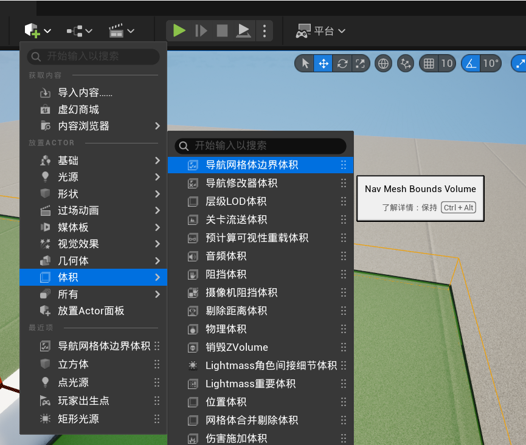
2.使用导航网格覆盖需要导航的位置

3.在场景中选择导航网格，按P键显示导航网格
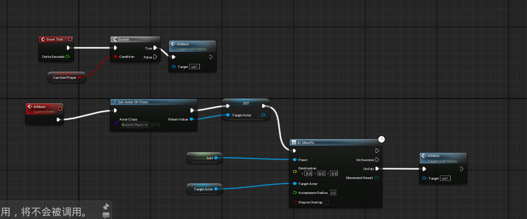

# 非AI物体平移

```cpp
void ABlockMove::BlockMove()
{
    FVector BlockPoint = this->GetActorLocation();
    FVector MoveLocation = (TagerPoint - BlockPoint)*BlockMoveSpeed;
    FVector NewLocation = BlockPoint + MoveLocation;
    this->SetActorLocation(NewLocation);
}
```

# UI

## 获取控件类中的变量

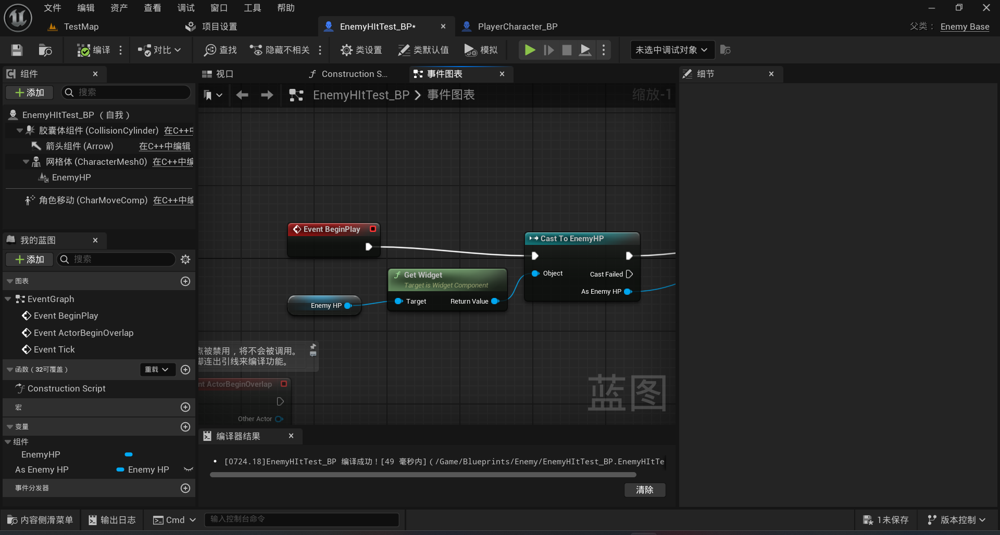

## 显示鼠标光标

1.获取玩家控制器（蓝图节点：Get Player Contoller）
2.从玩家控制器中设置显示鼠标光标（蓝图节点：Set Show Mouse Cursor）
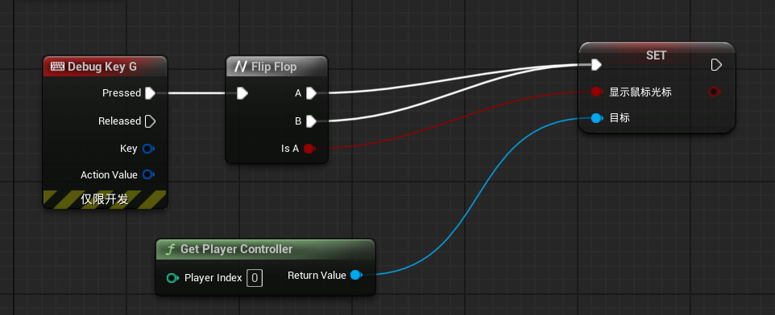

## 将UI显示到视口

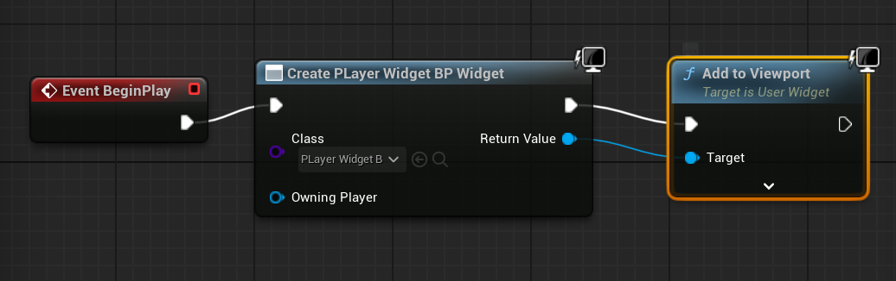

# 头文件集合

```cpp
#include "GameFramework/PlayerController.h"//玩家控制器类
```

# 蓝图

## 序列执行


## 获取组件所属类

Get Owner
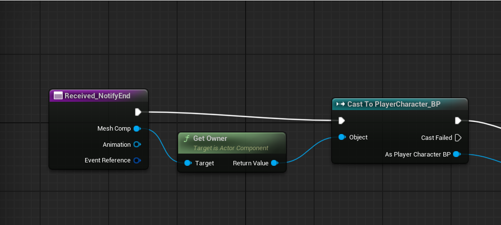

# UE变量名

## TArray

```cpp
// 创建数组
TArray<int32> IntArray;

// 添加元素
IntArray.Add(10);
IntArray.Emplace(20); // 原地构造，效率更高

// 访问元素
int32 FirstElement = IntArray[0];

// 遍历数组
for(int32 Num : IntArray) {
    UE_LOG(LogTemp, Warning, TEXT("%d"), Num);
}

// 删除元素
IntArray.Remove(10); // 按值删除
IntArray.RemoveAt(0); // 按索引删除
```

# 枚举类型

```cpp
// 在头文件中定义状态枚举
UENUM(BlueprintType)
enum class ECharacterState : uint8
{
    Idle,
    Walking,
    Running,
    Jumping,
    Falling
};

// 当前状态变量
ECharacterState CurrentState;

// 状态更新函数
void UpdateState()
{
    switch(CurrentState)
    {
        case ECharacterState::Idle:
            // 闲置逻辑
            break;
        case ECharacterState::Walking:
            // 行走逻辑
            break;
        // 其他状态...
    }
}

// 状态转换函数
void SetState(ECharacterState NewState)
{
    if(CurrentState != NewState)
    {
        ExitState(CurrentState);
        CurrentState = NewState;
        EnterState(NewState);
    }
}
```

# 获取世界中的目标类

头文件

```cpp
#include "Kismet/GameplayStatics.h"
```

```cpp
UWorld* world = GetWorld();
if (world) {
        AActor* FoundPawn = UGameplayStatics::GetActorOfClass(world, ABP_Player::StaticClass());
        }
```

# 事件委托

## 虚幻引擎委托(Delegate)详细指南

### 1. 委托的基本概念

**委托是什么？**
委托是一种类型安全的函数指针，允许你调用一个或多个函数，而无需知道这些函数的具体实现。简单说，就是**"当A发生时，自动调用B、C、D..."**的机制。

### 2. 委托的四种主要类型

#### 2.1 单播委托 (Unicast Delegates)

**特点：** 只能绑定一个函数
**用途：** 回调函数、简单事件处理

```cpp
// 声明
DECLARE_DELEGATE_OneParam(FOnItemPickedUp, FName);

// 使用
class APlayer
{
public:
    FOnItemPickedUp OnItemPickedUp;

    void PickUpItem(FName ItemName)
    {
        // ... 拾取逻辑

        // 触发委托
        OnItemPickedUp.ExecuteIfBound(ItemName);
    }
};

// 绑定
Player.OnItemPickedUp.BindRaw(this, &AInventory::HandleItemPickedUp);
```

#### 2.2 多播委托 (Multicast Delegates)

**特点：** 可以绑定多个函数
**用途：** 事件系统、观察者模式

```cpp
// 声明
DECLARE_MULTICAST_DELEGATE_OneParam(FOnPlayerDied, APlayer*);

// 使用
class AGameMode
{
public:
    FOnPlayerDied OnPlayerDied;

    void PlayerDied(APlayer* Player)
    {
        // 广播给所有监听者
        OnPlayerDied.Broadcast(Player);
    }
};

// 多个对象可以绑定到同一个委托
GameMode.OnPlayerDied.AddRaw(this, &AUI::ShowDeathScreen);
GameMode.OnPlayerDied.AddRaw(this, &AAchievements::HandlePlayerDeath);
```

#### 2.3 动态委托 (Dynamic Delegates)

**特点：** 支持序列化，可以在蓝图中使用
**用途：** 蓝图/C++混合开发

```cpp
// 声明
DECLARE_DYNAMIC_DELEGATE_OneParam(FOnHealthChanged, float, NewHealth);

// 使用
UCLASS()
class AHealthComponent : public UActorComponent
{
    GENERATED_BODY()

public:
    UPROPERTY(BlueprintAssignable)
    FOnHealthChanged OnHealthChanged;

    void SetHealth(float NewHealth)
    {
        Health = NewHealth;
        OnHealthChanged.ExecuteIfBound(NewHealth);
    }
};
```

#### 2.4 动态多播委托 (Dynamic Multicast Delegates)

**最常用的类型！**
**特点：** 多播 + 动态，支持蓝图和序列化

```cpp
// 声明
DECLARE_DYNAMIC_MULTICAST_DELEGATE_OneParam(FOnScoreChanged, int32, NewScore);

UCLASS()
class APlayerState : public AActor
{
    GENERATED_BODY()

public:
    // 委托实例
    UPROPERTY(BlueprintAssignable)
    FOnScoreChanged OnScoreChanged;

    UFUNCTION(BlueprintCallable)
    void AddScore(int32 Points)
    {
        Score += Points;
        OnScoreChanged.Broadcast(Score);  // 触发所有绑定的函数
    }
};
```

### 3. 参数数量的不同声明

```cpp
// 无参数
DECLARE_DYNAMIC_MULTICAST_DELEGATE(FOnGameStarted);

// 1个参数
DECLARE_DYNAMIC_MULTICAST_DELEGATE_OneParam(FOnHealthChanged, float, NewHealth);

// 2个参数
DECLARE_DYNAMIC_MULTICAST_DELEGATE_TwoParams(FOnDamageTaken, float, Damage, AActor*, DamageCauser);

// 3个参数
DECLARE_DYNAMIC_MULTICAST_DELEGATE_ThreeParams(FOnItemCollected, FName, ItemName, int32, Quantity, APlayer*, Collector);

// 4个参数
DECLARE_DYNAMIC_MULTICAST_DELEGATE_FourParams(FOnQuestUpdated, FName, QuestID, int32, Progress, int32, Target, bool, IsCompleted);

// 5个参数
DECLARE_DYNAMIC_MULTICAST_DELEGATE_FiveParams(FOnMultiplayerEvent, FString, EventType, int32, PlayerID, FVector, Location, float, Value, bool, IsCritical);

// 6个参数
DECLARE_DYNAMIC_MULTICAST_DELEGATE_SixParams(FOnComplexEvent, ...);

// 7个参数
DECLARE_DYNAMIC_MULTICAST_DELEGATE_SevenParams(FOnVeryComplexEvent, ...);

// 8个参数
DECLARE_DYNAMIC_MULTICAST_DELEGATE_EightParams(FOnExtremelyComplexEvent, ...);

// 9个参数（最大）
DECLARE_DYNAMIC_MULTICAST_DELEGATE_NineParams(FOnMaxParamsEvent, ...);
```

### 4. 绑定方式的详细说明

#### 4.1 绑定到UObject成员函数

```cpp
// 动态委托使用 AddDynamic
OnHealthChanged.AddDynamic(this, &AMyActor::HandleHealthChanged);

// 非动态委托使用 AddUObject
OnPlayerDied.AddUObject(this, &AGameMode::HandlePlayerDeath);
```

#### 4.2 绑定到原始C++函数

```cpp
// 适用于非UObject类
OnGameEvent.AddRaw(this, &FMyUtilityClass::HandleGameEvent);
```

#### 4.3 绑定到Lambda函数

```cpp
OnScoreChanged.AddLambda([this](int32 NewScore)
{
    UE_LOG(LogTemp, Warning, TEXT("Score changed to: %d"), NewScore);
    UpdateScoreUI(NewScore);
});
```

#### 4.4 绑定到静态函数

```cpp
OnConfigLoaded.AddStatic(&FConfigManager::HandleConfigLoaded);
```

#### 4.5 绑定到共享指针

```cpp
TSharedPtr<FMyClass> MyObject = MakeShared<FMyClass>();
OnDataReceived.AddSP(MyObject, &FMyClass::HandleData);
```

### 5. 完整的使用示例

#### 头文件

```cpp
// GameEvents.h
UCLASS()
class AGameEventManager : public AActor
{
    GENERATED_BODY()

public:
    AGameEventManager();

    // 声明各种委托
    DECLARE_DYNAMIC_MULTICAST_DELEGATE(FOnGameStarted);
    DECLARE_DYNAMIC_MULTICAST_DELEGATE_OneParam(FOnPlayerHealthChanged, float, NewHealth);
    DECLARE_DYNAMIC_MULTICAST_DELEGATE_TwoParams(FOnPlayerLevelUp, int32, NewLevel, int32, PreviousLevel);

    // 委托实例
    UPROPERTY(BlueprintAssignable, Category = "Game Events")
    FOnGameStarted OnGameStarted;

    UPROPERTY(BlueprintAssignable, Category = "Game Events")
    FOnPlayerHealthChanged OnPlayerHealthChanged;

    UPROPERTY(BlueprintAssignable, Category = "Game Events")
    FOnPlayerLevelUp OnPlayerLevelUp;

    // 触发事件的方法
    UFUNCTION(BlueprintCallable, Category = "Game Events")
    void StartGame();

    UFUNCTION(BlueprintCallable, Category = "Game Events")
    void UpdatePlayerHealth(float NewHealth);

    UFUNCTION(BlueprintCallable, Category = "Game Events")
    void PlayerLevelUp(int32 NewLevel);

private:
    // 处理函数
    UFUNCTION()
    void HandleGameStarted();

    UFUNCTION()
    void HandleHealthChanged(float NewHealth);

    UFUNCTION()
    void HandleLevelUp(int32 NewLevel, int32 PreviousLevel);
};
```

#### 源文件

```cpp
// GameEvents.cpp
#include "GameEvents.h"

AGameEventManager::AGameEventManager()
{
    PrimaryActorTick.bCanEverTick = false;
}

void AGameEventManager::BeginPlay()
{
    Super::BeginPlay();

    // 绑定委托到处理函数
    OnGameStarted.AddDynamic(this, &AGameEventManager::HandleGameStarted);
    OnPlayerHealthChanged.AddDynamic(this, &AGameEventManager::HandleHealthChanged);
    OnPlayerLevelUp.AddDynamic(this, &AGameEventManager::HandleLevelUp);
}

void AGameEventManager::StartGame()
{
    UE_LOG(LogTemp, Warning, TEXT("Game Started!"));
    OnGameStarted.Broadcast();
}

void AGameEventManager::UpdatePlayerHealth(float NewHealth)
{
    UE_LOG(LogTemp, Warning, TEXT("Player health updated: %.1f"), NewHealth);
    OnPlayerHealthChanged.Broadcast(NewHealth);
}

void AGameEventManager::PlayerLevelUp(int32 NewLevel)
{
    static int32 CurrentLevel = 1;
    int32 PreviousLevel = CurrentLevel;
    CurrentLevel = NewLevel;

    UE_LOG(LogTemp, Warning, TEXT("Player leveled up from %d to %d"), PreviousLevel, NewLevel);
    OnPlayerLevelUp.Broadcast(NewLevel, PreviousLevel);
}

// 处理函数实现
void AGameEventManager::HandleGameStarted()
{
    UE_LOG(LogTemp, Warning, TEXT("Handling game start event"));
    // 初始化游戏逻辑
}

void AGameEventManager::HandleHealthChanged(float NewHealth)
{
    UE_LOG(LogTemp, Warning, TEXT("Handling health change: %.1f"), NewHealth);

    if (NewHealth <= 0.0f)
    {
        UE_LOG(LogTemp, Error, TEXT("Player died!"));
    }
    else if (NewHealth < 30.0f)
    {
        UE_LOG(LogTemp, Warning, TEXT("Low health warning"));
    }
}

void AGameEventManager::HandleLevelUp(int32 NewLevel, int32 PreviousLevel)
{
    UE_LOG(LogTemp, Warning, TEXT("Handling level up: %d -> %d"), PreviousLevel, NewLevel);

    // 解锁新能力、更新UI等
    if (NewLevel >= 10)
    {
        UE_LOG(LogTemp, Warning, TEXT("Reached milestone level!"));
    }
}
```

### 6. 在蓝图中使用委托

#### 绑定蓝图事件：

1. 在蓝图中获取委托持有者的引用
2. 右键点击 → "Assign On [EventName]"
3. 连接到自定义事件节点

#### 触发蓝图事件：

1. 调用会广播委托的C++函数
2. 或者直接在蓝图中调用广播函数

### 7. 委托的最佳实践

#### 7.1 内存管理

```cpp
// 在析构函数中取消绑定
virtual ~AMyActor()
{
    OnHealthChanged.RemoveAll(this);
}

// 或者使用弱引用
TWeakObjectPtr<UObject> WeakThis = this;
OnEvent.AddLambda([WeakThis]()
{
    if (UObject* Object = WeakThis.Get())
    {
        // 安全地使用对象
    }
});
```

#### 7.2 性能考虑

```cpp
// 检查是否有绑定再广播
if (OnHealthChanged.IsBound())
{
    OnHealthChanged.Broadcast(NewHealth);
}

// 或者使用 ExecuteIfBound（单播）
OnItemPickedUp.ExecuteIfBound(ItemName);
```

#### 7.3 委托命名约定

```cpp
// 好的命名
DECLARE_DYNAMIC_MULTICAST_DELEGATE_OneParam(FOnHealthChanged, float, NewHealth);
DECLARE_DYNAMIC_MULTICAST_DELEGATE(FOnGamePaused);

// 不好的命名
DECLARE_DYNAMIC_MULTICAST_DELEGATE_OneParam(FDelegate1, float, Param1);
```

### 8. 常见问题解决

#### 8.1 委托未触发

- 检查是否已经绑定
- 检查绑定时机是否正确
- 检查广播是否被调用

#### 8.2 对象已销毁导致的崩溃

- 使用弱引用或智能指针
- 在析构函数中取消绑定
- 使用 `IsBound()` 检查

#### 8.3 蓝图绑定失败

- 确保委托有 `BlueprintAssignable` 标记
- 确保处理函数是 `UFUNCTION()`
- 检查参数类型匹配

**总结：** 委托是虚幻引擎中最重要的通信机制之一，掌握委托可以让你写出更加模块化、可维护的代码。动态多播委托是最常用的类型，因为它既强大又支持蓝图。

## 监听单一变量的变化

1. 被监听类（包含变量的类）

```cpp
         // 声明委托
         DECLARE_DYNAMIC_MULTICAST_DELEGATE_OneParam(FOnSelectPawnChange, ACharacter_Pawn*, SelectPawn);
```

``DECLARE_DYNAMIC_MULTICAST_DELEGATE_OneParam（委托实例，被监听的变量类型，被监听的变量名）``
申明定义

```cpp
         UPROPERTY(EditAnywhere, BlueprintReadWrite)
         ACharacter_Pawn* SelectPawn;

         // 委托实例（其他类可以绑定到这个委托）
         UPROPERTY(BlueprintAssignable, Category = "Player")
         FOnSelectPawnChange OnSelectPawnChange;
```

```cpp
         // 触发委托，所有监听者都会收到通知
         OnSelectPawnChange.Broadcast(SelectPawn);
```

1. 监听类

```cpp
         // 绑定到SelectPawn变化的函数
         UFUNCTION()
         void OnSelectPawnChanged(ACharacter_Pawn* NewSelectPawn);
```

```cpp
         //绑定SelectPawn变化
         Player->OnSelectPawnChange.AddDynamic(this, &AFloorBase::OnSelectPawnChanged);
```

# 镜子
## 场景捕获+材质渲染（一个场景中不可出现多个镜子）
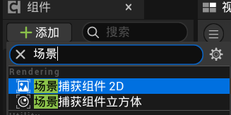
**1.添加捕获组件2D（摄像头）**
**2.添加一个平面**
**3.创建一个材质球**
**4.创建纹理**
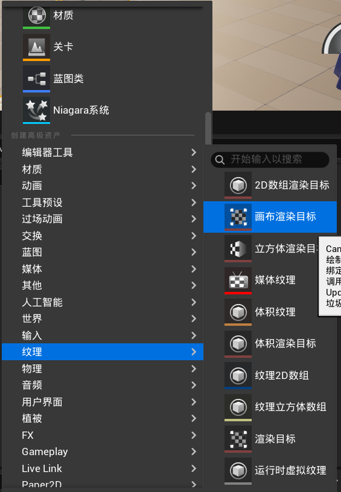
``画布渲染目标,把摄像头捕获的场景渲染``
**5.将纹理连接到材质球**
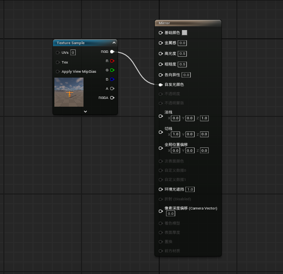
**6.在摄像机组件中选择目标纹理（画布渲染纹理）**
**7.让平面使用材质**

## 镜子蓝图(可在场景中大量摆放)
### 在上述过程基础上把纹理节点提升为参数
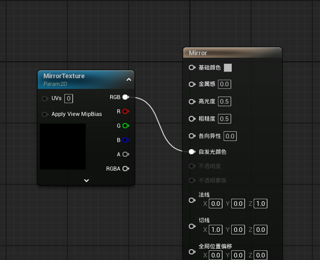
**右键点击，提升为参数**
### 创建2D纹理画布
**将其设置为相机组件的目标纹理**

*获取镜子（平面网格体）的材质*
***一定要有基础材质，以此为基础创建每个镜子的材质***
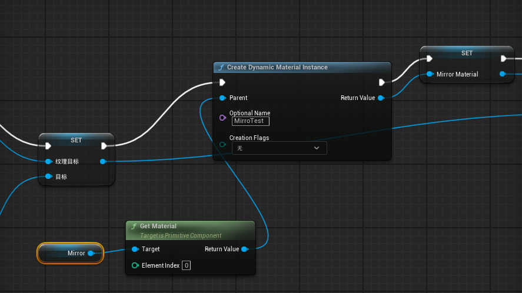
### 将这个材质的纹理修改为相机绘制的纹理 
*Parameter Name是材质中被提升为参数的纹理，的参数名*
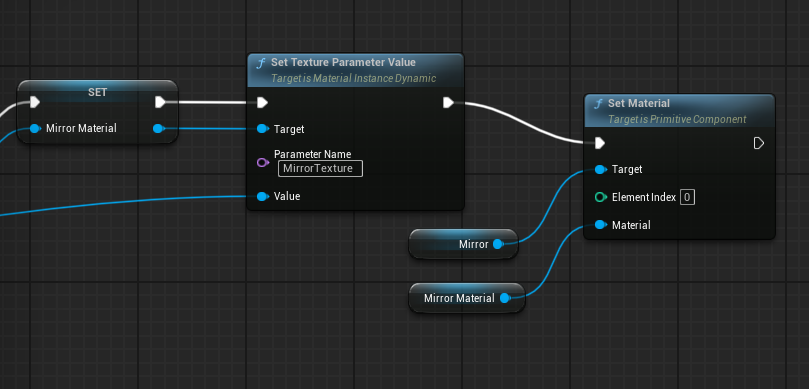
### 优化
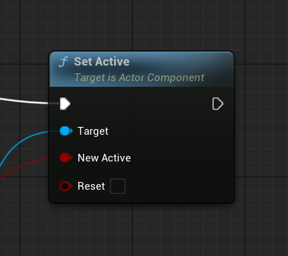
***在超出一定距离的情况下停止相机的活动***
# 性能优化
## 距离剔除
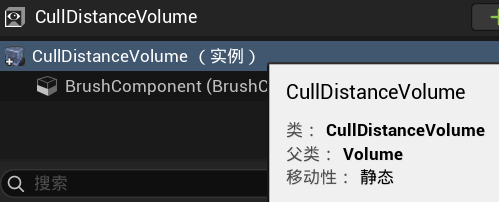
在场景中添加，把需要剔除的物体框起来，就可以设置需要剔除的物体size以及距离（可以设置多组）
## 流试关卡加载